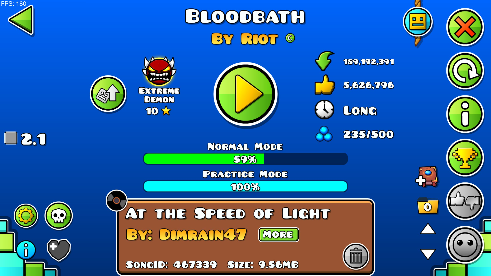
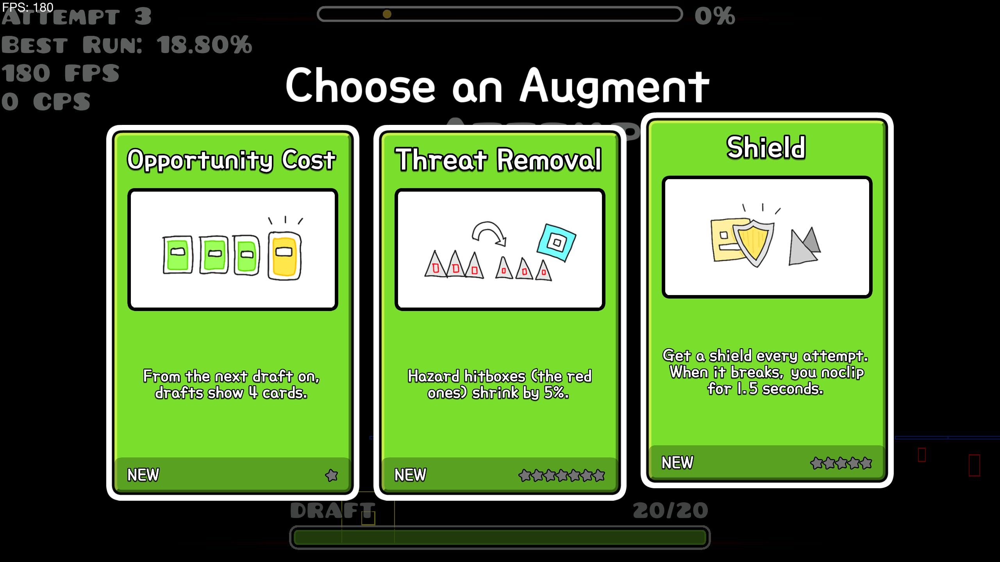
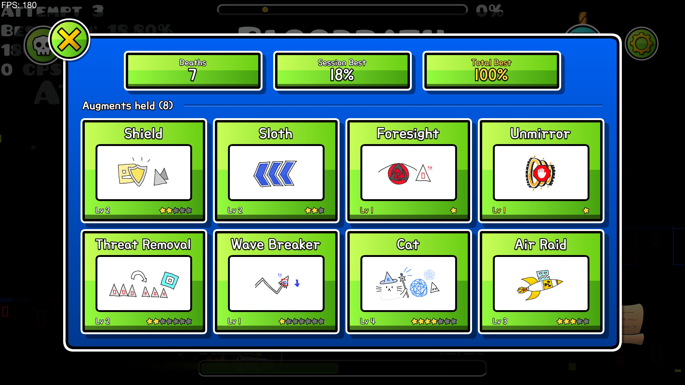
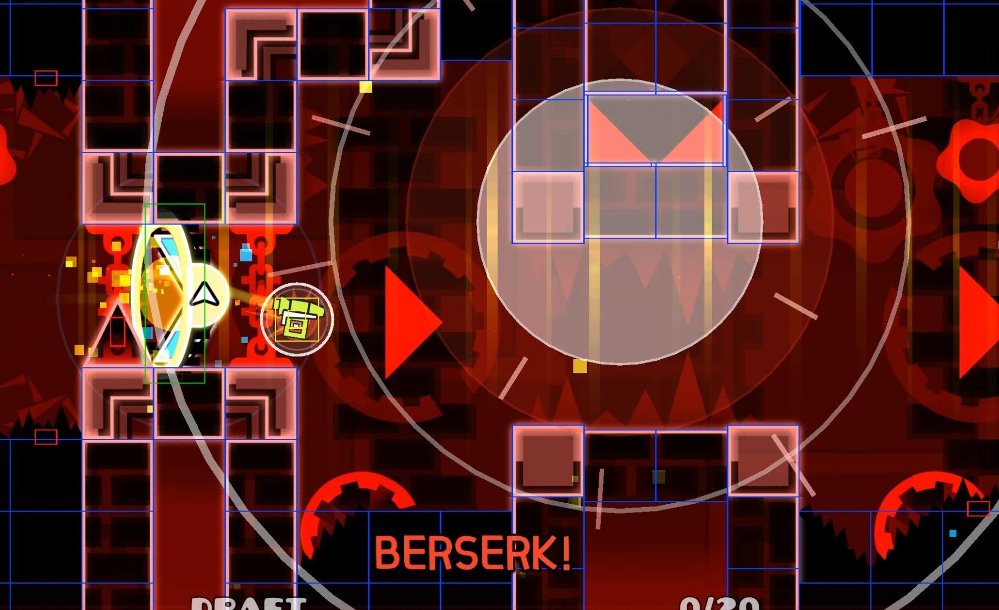
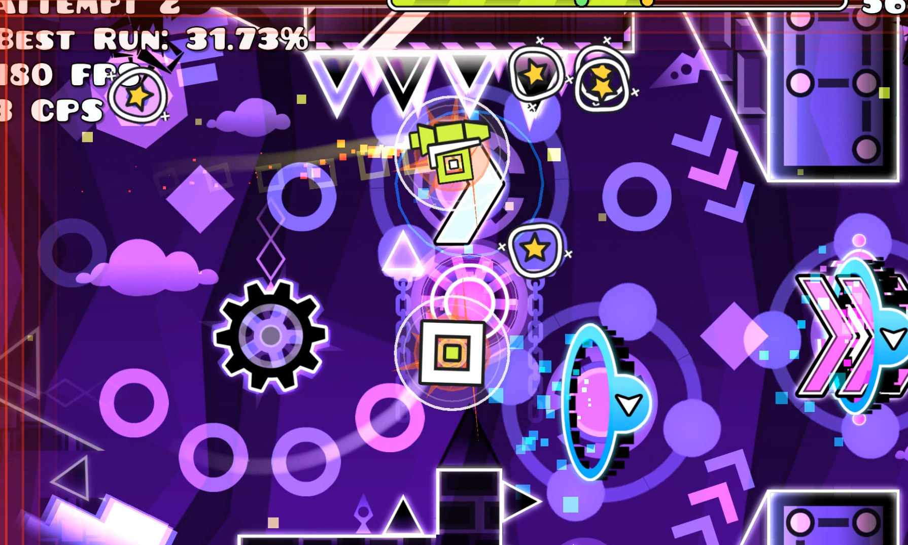

# Augmented GD


A [Geode](https://geode-sdk.org) mod for Geometry Dash that turns any level into a roguelite run: die, draft an augment, get stronger, and keep going until you beat it.

## How a run works

1. Open an online level and press the round button next to the difficulty face. The run starts with a free draft.
2. Every death charges the **draft gauge** by the percent you reached. Beating your best for the run pays the new percents twice.
3. When the gauge is full, you draft as you respawn: pick one of three augments. Picking one you already have levels it up.
4. Clear the level with what you have drafted and the run is won.

Pause during a run to see the augments you hold and their levels.

## Augments

13 augments, each with its own maximum level: Shield, Sloth, Checkpoint, Foresight, Unmirror, Threat Removal, Wave Breaker, Calm Nerves, Opportunity Cost, Cat, Brake, Air Raid and Berserker.

## Controls

- **X**: toggle Sloth
- **Z**: place a checkpoint
- **C** (hold): brake

All three can be rebound in the mod's settings.

## Gallery











## Notes

- Runs never count as real progress: no normal-mode percent, no New Best!, no level completion. The mod keeps its own record for each level instead.
- English and Korean, picked in the mod's settings.
- Windows only for now (Geometry Dash 2.2081, Geode 5.10.1).

## Building

Needs Windows, the [Geode SDK and CLI](https://docs.geode-sdk.org/getting-started/), LLVM clang, CMake, Ninja, and Python 3 with Pillow and fonttools (`py -3 -m pip install pillow fonttools`).

```powershell
.\scripts\build.ps1
```

This runs the host tests, bakes the UI fonts, builds the mod and installs it into Geometry Dash.

## Feedback

Bugs, augment ideas and questions: open an [issue](https://github.com/seojoonrp/augmented-gd/issues) or email **seojoonrp@gmail.com**.

## License

The code is under the [MIT License](LICENSE). The fonts in `resources/fonts` keep their own licenses (Pretendard: SIL Open Font License 1.1, see `LICENSE-Pretendard.txt`).
